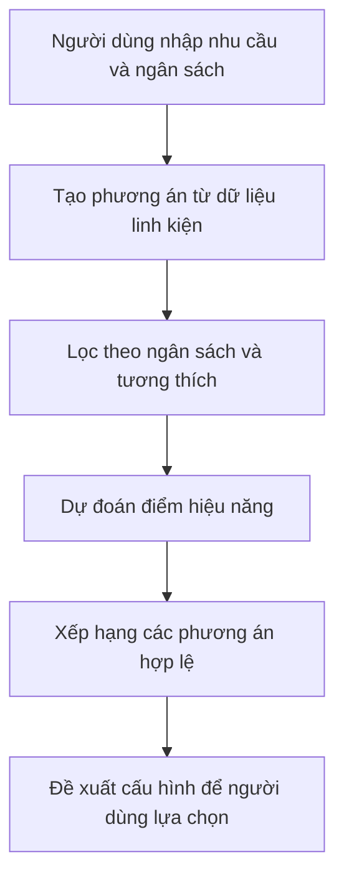

# Báo cáo giữa kỳ PC-DSS

**Đề tài: Hệ hỗ trợ lựa chọn cấu hình máy tính cá nhân theo nhu cầu và ngân sách**  
**Thời điểm cập nhật: 22/09/2026**

PC-DSS hướng đến việc giúp người dùng chọn linh kiện để lắp một máy tính phù hợp với nhu cầu và số tiền có thể chi. Hệ thống dự kiến kiểm tra giá, khả năng tương thích, dự đoán điểm hiệu năng và đề xuất các cấu hình để người dùng cân nhắc.

Ở giai đoạn giữa kỳ, nhóm đã chuẩn bị dữ liệu ban đầu, có backend quản lý dữ liệu, giao diện và kết quả thử nghiệm mô hình gaming. **Các phần này chưa được tích hợp thành một luồng tư vấn hoàn chỉnh.** Báo cáo tập trung giải thích dữ liệu, quá trình thay đổi mô hình gaming, kết quả đánh giá và công việc còn lại.

## Nội dung

1. [Bài toán và cách hệ thống dự kiến hỗ trợ](#bai-toan)
2. [Dữ liệu đang sử dụng](#du-lieu)
3. [Time Spy và điểm tham chiếu là gì](#benchmark)
4. [Đầu vào và đầu ra của mô hình gaming](#dau-vao-dau-ra)
5. [Mô hình ban đầu và lý do thay đổi](#thay-doi-mo-hinh)
6. [Mô hình gaming hiện tại](#mo-hinh-hien-tai)
7. [Cách chuẩn bị dữ liệu và huấn luyện](#huan-luyen)
8. [Ý nghĩa MAE, RMSE và R²](#chi-so)
9. [Kết quả thử nghiệm](#ket-qua)
10. [Tiến độ và hướng hoàn thiện](#tien-do)
11. [Giải thích thêm và tài liệu đối chiếu](#doi-chieu)

Các mục mở rộng chứa công thức và ví dụ chi tiết. Bảng dữ liệu và kết quả chính được trình bày trực tiếp để thuận tiện theo dõi.

<a id="bai-toan"></a>

## 1. Bài toán và cách hệ thống dự kiến hỗ trợ

Ví dụ, một người có **20 triệu đồng để lắp máy chơi game** cần chọn CPU, GPU, RAM và các linh kiện còn lại. Khó khăn là phải chọn được những linh kiện dùng chung với nhau, không vượt ngân sách và đáp ứng nhu cầu trong khả năng của số tiền đó.

Hướng xử lý của PC-DSS gồm:

1. Nhận **nhu cầu sử dụng và ngân sách tối đa**.
2. Lấy các linh kiện có trong cơ sở dữ liệu để tạo phương án cấu hình.
3. Loại phương án vượt ngân sách hoặc không đáp ứng những quy tắc tương thích đã xây dựng.
4. Dùng mô hình của nhu cầu tương ứng để dự đoán điểm hiệu năng.
5. Xếp hạng các phương án hợp lệ và trả về tối đa ba cấu hình, kèm tổng giá và lý do đề xuất.



**Sơ đồ trên là luồng dự kiến của hệ thống.** Mô hình hồi quy đảm nhiệm bước dự đoán điểm, chưa tự giải quyết việc chọn đủ linh kiện, tính tiền hay kiểm tra tương thích. Người dùng vẫn là người quyết định cuối cùng.

<a id="du-lieu"></a>

## 2. Dữ liệu đang sử dụng

Nhóm có hai file Excel với ba vai trò dữ liệu khác nhau. **Số file không phải số loại dữ liệu, và số sản phẩm không phải số mẫu huấn luyện.**

| File và sheet | Nội dung | Vai trò |
|---|---|---|
| `dữ liệu PC.xlsx` — `CPU`, `RAM`, `GPU`, `MAINBOARD` | Thông tin sản phẩm, giá, nguồn và thông số linh kiện | Chuẩn bị dữ liệu nhập vào backend để tạo cấu hình, tính giá và kiểm tra tương thích |
| `Benchmark (6) (1).xlsx` — `ReferenceBenchmark` | Điểm PassMark tham chiếu theo model CPU/GPU | Cung cấp các điểm đầu vào có thể tra cho cấu hình mới |
| Cùng file — `Benchmark_Gaming` | Thông tin cấu hình và điểm Time Spy của từng lượt đo | Cung cấp dữ liệu để học và đánh giá mô hình gaming |
| Cùng file — `Benchmark_VanPhong` | Thông tin cấu hình và điểm PCMark 10 Productivity | Dữ liệu cho hướng văn phòng; mô hình đang xử lý, chưa báo cáo kết quả sử dụng |

### Quy mô dữ liệu benchmark đang đối chiếu

| Phần dữ liệu | Số lượng | Ý nghĩa |
|---|---:|---|
| Gaming trong Excel | 146 dòng | Mỗi dòng ghi một lượt benchmark, chưa chắc là một máy độc lập |
| Gaming được dùng trong gói mô hình | 144 dòng | Đáp ứng bộ lọc hiện tại, có trạng thái `ACCEPT` |
| Gaming chưa dùng | 2 dòng | `RUN-GAMING-020` và `RUN-GAMING-032` còn trạng thái `REVIEW` |
| Văn phòng trong Excel | 100 dòng | Có dữ liệu không đồng nghĩa mô hình đã được kiểm chứng |
| Điểm tham chiếu | 41 dòng | 15 CPU, mỗi CPU có hai loại điểm; 11 GPU, mỗi GPU có một loại điểm |

Các lượt benchmark được ghi lại từ trang kết quả công khai, với đường dẫn ở cột `SourceUrl`. Đây là dữ liệu thu thập từ các lượt đo đã có, **không phải nhóm tự lắp và đo 146 máy**. Bảng tham chiếu cũng lưu nguồn và ngày ghi nhận; điểm đang dùng là bản đã lưu trong Excel, không tự thay bằng điểm hiện tại trên website.

**Minh chứng dữ liệu:** các cột `RunId`, `CpuModel`, `GpuModel`, `Metric`, `Score`, `SourceUrl`, `ReviewStatus` trong sheet `Benchmark_Gaming`; các cột `ModelName`, `Metric`, `RawScore`, `SourceUrl` trong `ReferenceBenchmark`.

<a id="benchmark"></a>

## 3. Time Spy và điểm tham chiếu là gì

**Benchmark** là bài đo hiệu năng: phần mềm cho máy thực hiện một số tác vụ xác định rồi ghi nhận kết quả. Điểm benchmark giúp so sánh trong phạm vi bài đo đó.

### 3.1. Time Spy là điểm nhóm muốn dự đoán

**Time Spy** là một bài benchmark thuộc phần mềm **3DMark** của UL Solutions, sử dụng DirectX 12. Bài đo có phần đồ họa và phần CPU. Nhóm chọn **điểm tổng Time Spy, tức Overall**, làm đầu ra cho mô hình gaming. Tên đúng là *Time Spy*.

Điểm này được dùng làm chỉ báo hiệu năng trong phạm vi bài đo đã chọn. **Điểm Time Spy không phải số FPS của một trò chơi và không phải phần trăm phù hợp.** Ví dụ, dự đoán 10.000 điểm không có nghĩa máy chơi mọi game ở một mức FPS xác định. Nguồn: [UL giới thiệu Time Spy](https://benchmarks.ul.com/3dmark-time-spy).

### 3.2. PassMark là nguồn điểm tham chiếu đầu vào

| Loại điểm | Hiểu đơn giản | Vai trò trong dự án |
|---|---|---|
| **PassMark CPU Mark** | Điểm tổng hợp hiệu năng CPU từ các phép thử của PassMark | Đầu vào `CpuMultiScore` của mô hình hiện tại |
| **PassMark Single Thread Rating** | Điểm đo hiệu năng đơn luồng CPU | Đầu vào của các phương án ban đầu; bản cuối không dùng |
| **PassMark G3D Mark** | Điểm hiệu năng đồ họa 3D của GPU trong bộ đo PassMark | Đầu vào `GpuScore` của mô hình hiện tại |

Đây là các phép đo khác với Time Spy. Tên cột `CpuMultiScore` trong mã nguồn đang chỉ **PassMark CPU Mark**, không phải CPU Score của Time Spy. Nguồn: [PassMark CPU tests](https://www.cpubenchmark.net/cpu_test_info.html), [PassMark GPU tests](https://www.videocardbenchmark.net/gpu_test_info.html).

Gọi là **điểm tham chiếu** vì nhóm tra điểm đã lưu của model CPU/GPU để dùng cho các cấu hình có linh kiện đó. Ví dụ, các dòng dùng Ryzen 5 5500 đều được ghép cùng điểm CPU Mark trong bảng tham chiếu. Điểm này không phải kết quả đo CPU riêng của từng lượt Time Spy.

**Vì sao cần cả hai nguồn?** Khi xét một cấu hình chưa được đo, nhóm vẫn có thể tra điểm CPU/GPU của các model linh kiện. Mô hình học mối liên hệ giữa các điểm tham chiếu đó với điểm Time Spy từ những lượt đo đã có.

<details>
<summary>Phân biệt công thức điểm Time Spy của UL với công thức dự đoán của nhóm</summary>

Theo UL, điểm tổng Time Spy được tính từ Graphics Score và CPU Score **của chính bài đo Time Spy** bằng trung bình điều hòa có trọng số:

$$
S_{TimeSpy}=\frac{1}{0.85/S_{Graphics}+0.15/S_{CPU}}
$$

Nhóm không đưa điểm PassMark vào công thức này, vì chúng không phải hai điểm thành phần mà công thức yêu cầu. Nhóm xây dựng một mô hình học từ dữ liệu để **ước lượng** điểm tổng, khi chỉ biết điểm tham chiếu CPU/GPU.

Vì vậy, công thức hồi quy dạng nhân của nhóm không phải công thức chính thức tính điểm Time Spy của UL. Nguồn: [UL giải thích cách tính điểm Time Spy](https://support.benchmarks.ul.com/support/solutions/articles/44002136143-how-is-the-3dmark-time-spy-score-calculated-).

</details>

<a id="dau-vao-dau-ra"></a>

## 4. Đầu vào và đầu ra của mô hình gaming

### 4.1. Phân biệt hệ thống và mô hình

| Phạm vi | Đầu vào | Đầu ra |
|---|---|---|
| **Hệ thống PC-DSS dự kiến** | Nhu cầu, ngân sách và dữ liệu linh kiện | Các cấu hình được đề xuất, tổng giá, điểm dự đoán và lý do |
| **Mô hình gaming hiện tại** | `GpuScore` và `CpuMultiScore` | Một số: điểm **Time Spy Overall dự đoán** |

Giá dùng để lọc ngân sách; socket, loại RAM và công suất nguồn phục vụ kiểm tra tương thích. Những thông tin đó **không phải đầu vào của công thức hồi quy gaming hiện tại**.

### 4.2. Một mẫu dữ liệu cụ thể

Ví dụ lấy từ `RUN-GAMING-001`, dòng 2 của sheet `Benchmark_Gaming`:

| Thành phần | Giá trị đã lưu | Lấy ở đâu |
|---|---|---|
| CPU | AMD Ryzen 5 5500 | `Benchmark_Gaming.CpuModel` |
| GPU | NVIDIA GeForce RTX 3050 **8GB** | `Benchmark_Gaming.GpuModel` |
| Điểm CPU tham chiếu | **19.252** | `ReferenceBenchmark`, mã `REF-CPU-001-M`, loại `CPU Mark` |
| Điểm GPU tham chiếu | **12.460** | `ReferenceBenchmark`, mã `REF-GPU-001`, loại `G3D Mark` |
| Điểm Time Spy thực tế | **7.185** | `Benchmark_Gaming.Score`, loại `Overall` |

Sau khi ghép, mẫu dùng cho mô hình hiện tại là:

```text
Đầu vào X: GpuScore = 12460, CpuMultiScore = 19252
Nhãn y:    Score = 7185
```

**Nhãn** là đáp án thực tế có sẵn để mô hình học và để so với dự đoán. Khi dự đoán một cấu hình mới, mô hình chỉ nhận hai điểm đầu vào; không cần biết trước điểm Time Spy của cấu hình đó.

Việc ghép dùng tên model đã chuẩn hóa nhưng phải giữ đúng biến thể. Chẳng hạn **RTX 3050 6GB và RTX 3050 8GB không được ghép làm một**. File linh kiện hiện có bản 6GB, còn ví dụ benchmark trên là bản 8GB; cần xử lý đúng khi tích hợp.

*Quy ước trình bày: trong bảng tiếng Việt, dấu chấm phân cách hàng nghìn và dấu phẩy phân cách thập phân. Trong mã và công thức tính trực tiếp, dùng dấu chấm thập phân và không phân cách hàng nghìn.*

<a id="thay-doi-mo-hinh"></a>

## 5. Mô hình ban đầu và lý do thay đổi

Nhóm bắt đầu với **hồi quy tuyến tính nhiều biến**: dùng nhiều thông tin đầu vào để dự đoán một điểm số liên tục. Các hệ số được học từ dữ liệu, không phải trọng số nhóm tự đặt.

| Giai đoạn | Cách làm | Nhận xét và lý do tiếp tục điều chỉnh |
|---|---|---|
| **1. Dạng cộng trên điểm gốc** | Dùng điểm CPU đơn luồng, CPU Mark, GPU G3D Mark và dung lượng RAM | Dễ giải thích, làm mốc thử nghiệm. Mỗi biến có hệ số cố định; chưa có thành phần biểu diễn tác động kết hợp CPU–GPU |
| **2. Thêm biến tương tác** | Giữ bốn đầu vào trên, thêm hai tích điểm CPU × GPU | Giảm sai số so với bản đầu trong vòng thử nghiệm cũ, nhưng có trường hợp điểm dự đoán giảm khi chuyển sang CPU có CPU Mark cao hơn |
| **3. Hồi quy trên thang log với hệ số không âm** | Dùng GPU G3D Mark và CPU Mark; đổi cả đầu vào và nhãn sang log để học | Công thức gọn hơn, điểm dự đoán dương và không giảm khi tăng từng điểm đầu vào, giữ đầu vào còn lại cố định |

### Vì sao không giữ phương án có biến tương tác?

Trong bảng thử thay CPU, giữ **RTX 3050 8GB và RAM 32GB**, mô hình tương tác của vòng so sánh cho kết quả:

| CPU | CPU Mark tham chiếu | Điểm dự đoán của mô hình tương tác |
|---|---:|---:|
| Ryzen 5 5500 | 19.252 | 7.760,18 |
| Core Ultra 9 285K | 67.264 | 5.601,75 |

Đây là ví dụ về hành vi của công thức trên các tổ hợp thử, **không phải điểm benchmark thực đo của hai cấu hình này**. Khi thay model CPU, điểm đơn luồng cũng thay đổi. Ví dụ này không chứng minh CPU Mark quyết định toàn bộ hiệu năng chơi game, nhưng cho thấy mô hình có thể tạo ra thứ tự khó giải thích khi dùng để tư vấn.

Vì vậy, nhóm chọn một yêu cầu cho công thức mới: **giữ điểm GPU cố định thì tăng CPU Mark không làm giảm dự đoán, và ngược lại**. Tính chất này gọi là *không giảm theo từng đầu vào*.

Việc đổi mô hình là một lựa chọn có đánh đổi: bản log đáp ứng yêu cầu trên, nhưng **không đạt sai số thấp hơn mô hình tương tác ở mọi cách đánh giá**. Kết quả cụ thể ở mục 9.

<details>
<summary>Công thức của hai phương án trước</summary>

Đặt `S` là điểm CPU đơn luồng, `C` là CPU Mark, `G` là GPU G3D Mark và `R` là dung lượng RAM tính bằng GB.

**Dạng cộng ban đầu:**

$$
\hat y=\beta_0+\beta_1S+\beta_2C+\beta_3G+\beta_4R
$$

Ví dụ, khi tăng `C` một lượng cố định và giữ các biến còn lại không đổi, mức thay đổi dự đoán luôn bằng hệ số của `C` nhân với lượng tăng đó, bất kể điểm GPU đang cao hay thấp.

**Dạng có tương tác:**

$$
\hat y=\beta_0+\beta_1S+\beta_2C+\beta_3G+\beta_4R
+\beta_5\frac{SG}{10000}+\beta_6\frac{CG}{10000}
$$

Hai cột bổ sung trong notebook là `CpuSingle_x_Gpu` và `CpuMulti_x_Gpu`. Tích giúp mức ảnh hưởng của CPU có thể thay đổi theo điểm GPU. Chia cho `10000` chỉ đổi thang số của hai cột, không có nghĩa chúng đóng góp một tỷ lệ cố định.

Cả hai phương án đều tuyến tính theo các hệ số cần học. Chỉ nhìn một hệ số âm riêng lẻ của bản tương tác chưa đủ kết luận toàn bộ tác động của biến đó, vì còn có các tích liên quan.

</details>

<a id="mo-hinh-hien-tai"></a>

## 6. Mô hình gaming hiện tại

Tên phương pháp: **hồi quy tuyến tính nhiều biến trên thang log, có ràng buộc hệ số không âm**.

Mô hình học mối liên hệ:

$$
\ln(y)\approx a+b\ln(G)+c\ln(C),\qquad b,c\geq0
$$

Khi dự đoán, đổi ngược về điểm gốc:

$$
\boxed{\hat y=e^aG^bC^c=A\times G^b\times C^c}
$$

| Ký hiệu | Ý nghĩa |
|---|---|
| `G` | Điểm GPU G3D Mark tham chiếu |
| `C` | Điểm CPU Mark tham chiếu |
| `y` | Điểm Time Spy Overall thực tế khi huấn luyện |
| `ŷ` | Điểm Time Spy Overall dự đoán |
| `a`, `b`, `c` | Ba hệ số được học từ dữ liệu |
| `ln` và `exp` | Logarit tự nhiên và phép đổi ngược; `A = exp(a)` |

**Train là tìm các hệ số phù hợp với dữ liệu.** Sau khi học, hệ số được giữ lại để tính điểm cho đầu vào khác. Nhóm không chỉ thay dấu cộng bằng dấu nhân trong công thức cũ; nhóm thay cách biểu diễn dữ liệu, tập đầu vào và điều kiện đối với hệ số.

### Công thức của gói mô hình cuối

Gói `gaming_final.zip`, phiên bản `gaming-log-v1-20260920T194416994761Z`, lưu:

```text
Score = 0.006512728314282055
        × GpuScore^1.2396715874601234
        × CpuMultiScore^0.21617706922388444
```

Với đầu vào ở mục 4, công thức cho khoảng **6.562,45 điểm**. Nhãn thực tế của lượt `RUN-GAMING-001` là **7.185 điểm**, độ lệch tuyệt đối khoảng **622,55 điểm**. Đây là ví dụ tính bằng bản cuối đã học toàn bộ 144 dòng, gồm chính dòng này, **không phải kiểm tra trên mẫu mới**.

Hai điểm đầu vào phải hữu hạn và lớn hơn 0. Thiếu điểm tham chiếu thì cần báo chưa đủ dữ liệu, không điền 0 hoặc tự thay bằng 1 để tính tiếp.

<details>
<summary>Vì sao dùng log, vì sao vẫn gọi là hồi quy tuyến tính, và hệ số không âm làm gì?</summary>

**Log giúp biểu diễn quan hệ dạng nhân thành dạng cộng để học:**

$$
\ln(AG^bC^c)=\ln(A)+b\ln(G)+c\ln(C)
$$

Đặt `z = ln(y)`, `u = ln(G)`, `v = ln(C)`, ta có `z ≈ a + bu + cv`. Phương trình tuyến tính theo ba hệ số `a`, `b`, `c`; trên thang điểm gốc, quan hệ là dạng nhân lũy thừa. Đây là **hồi quy log–log**, không phải hồi quy logistic.

Trong mô hình này, tăng đầu vào theo tỷ lệ làm dự đoán thay đổi theo tỷ lệ. Chẳng hạn giữ `G` cố định và nhân `C` với `k`, điểm dự đoán nhân với `k^c`. Các số mũ không phải phần trăm đóng góp của CPU/GPU và không cần cộng thành 1.

**Log tự nó không ngăn hệ số âm.** Mã huấn luyện dùng `LinearRegression(positive=True)` để ràng buộc `b, c ≥ 0`. Hệ số chặn `a` vẫn có thể âm; `A = exp(a)` luôn dương. Tham khảo: [LinearRegression](https://scikit-learn.org/1.6/modules/generated/sklearn.linear_model.LinearRegression.html).

Với `G, C > 0` và các số mũ không âm, tăng từng đầu vào khi giữ đầu vào kia cố định sẽ không làm giảm dự đoán. Đây là giả định thiết kế của mô hình, không phải khẳng định mọi CPU có CPU Mark cao hơn đều chơi mọi game tốt hơn.

Mô hình hai biến cũng có giới hạn: cùng `G` và `C` thì dự đoán giống nhau dù dung lượng RAM hay điều kiện chạy khác nhau. Bỏ RAM và điểm CPU đơn luồng khỏi bản cuối **không có nghĩa các yếu tố đó không ảnh hưởng đến hiệu năng thực tế**.

</details>

<a id="huan-luyen"></a>

## 7. Cách chuẩn bị dữ liệu và huấn luyện

| Bước | Công việc | Mục đích |
|---|---|---|
| 1. Chọn dữ liệu | Lấy gaming có `ReviewStatus = ACCEPT`, `TestName = Time Spy`, `Metric = Overall` | Dùng đúng loại điểm cần dự đoán |
| 2. Ghép tham chiếu | Chuẩn hóa tên CPU/GPU và tra đúng model, loại điểm, biến thể | Tạo các cột đầu vào cho mô hình |
| 3. Kiểm tra | Kiểm tra mã lượt đo, đường dẫn trùng, tham chiếu không duy nhất, số thiếu hoặc không hợp lệ | Phát hiện lỗi trước khi học |
| 4. Chia tập | Vòng so sánh có **115 dòng train và 29 dòng test**, chia theo nhóm cặp CPU–GPU | Các lượt cùng một cặp không nằm ở cả hai phía |
| 5. Kiểm định chéo | Chia phần train thành **5 phần theo nhóm**, lần lượt học trên 4 phần và đánh giá phần còn lại | Quan sát kết quả qua nhiều lần chia trong tập train |
| 6. Học và đánh giá | Lấy log đầu vào/nhãn, học hệ số không âm; đổi dự đoán về điểm gốc | Tính MAE, RMSE, R² bằng đơn vị điểm dễ hiểu |
| 7. Xuất bản cuối | Sau khi chọn phương án, học lại trên **144 dòng** và lưu hệ số, dữ liệu, kết quả | Chuẩn bị mô hình cho bước tích hợp sau này |

**Train** là phần dữ liệu dùng để tìm hệ số. **Test** là phần được giữ ngoài lần học đó để so sánh dự đoán với đáp án thực tế. **Kiểm định chéo (CV)** là việc luân phiên phần học và phần đánh giá trong tập train; không phải học rồi chấm lại chính các dòng vừa học trong mỗi lượt.

Vòng ban đầu dùng `GroupShuffleSplit(test_size=0.2, random_state=42)` và `GroupKFold(5)`. Vòng so sánh sau giữ danh sách chia đã lưu. Gói so sánh hiện có **99 nhóm CPU–GPU ở train, 25 nhóm ở test, không trùng nhóm giữa hai tập**. CPU riêng hoặc GPU riêng vẫn có thể xuất hiện ở cả hai tập; đây chưa phải phép thử với toàn bộ linh kiện chưa từng thấy.

**Giới hạn của đánh giá hiện tại:** nhóm đã xem tập test trong quá trình phát triển. Do đó, kết quả là bằng chứng thử nghiệm, chưa thay thế được kiểm chứng trên dữ liệu mới chưa dùng để điều chỉnh mô hình. Sau khi học lại toàn bộ 144 dòng, các dòng test cũ cũng đã tham gia học bản cuối.

<details>
<summary>Mô hình tối ưu gì trong lúc huấn luyện?</summary>

Với `n` mẫu trong phần học, mô hình log tìm `a`, `b`, `c` để làm nhỏ:

$$
\sum_{i=1}^{n}\left[\ln(y_i)-\left(a+b\ln(G_i)+c\ln(C_i)\right)\right]^2,
\qquad b,c\geq0
$$

Đây là **tổng bình phương sai số trên thang log**. Mô hình không trực tiếp tối ưu MAE trên điểm gốc, cũng không trực tiếp tối ưu thứ hạng cấu hình.

Phần mã chính của phương án này:

```python
TransformedTargetRegressor(
    regressor=Pipeline([
        ("log_input", FunctionTransformer(np.log, validate=True)),
        ("linear", LinearRegression(positive=True))
    ]),
    func=np.log,
    inverse_func=np.exp
)
```

`FunctionTransformer` lấy log đầu vào. `TransformedTargetRegressor` lấy log nhãn khi học và dùng `exp` để đổi dự đoán về điểm gốc. Thư viện giải bài toán tìm hệ số; đoạn mã này không yêu cầu nhóm tự chọn số epoch hoặc learning rate. Tham khảo: [TransformedTargetRegressor](https://scikit-learn.org/1.6/modules/generated/sklearn.compose.TransformedTargetRegressor.html).

Quy trình so sánh còn kiểm tra đủ các cột của bản tương tác, gồm CPU đơn luồng và RAM, để các phương án được đánh giá trên cùng tập mẫu. Công thức bản cuối chỉ nhận hai điểm `GpuScore`, `CpuMultiScore`.

</details>

<a id="chi-so"></a>

## 8. Ý nghĩa MAE, RMSE và R²

Mỗi mẫu có **điểm thực tế** và **điểm dự đoán**. Các chỉ số dưới đây tổng hợp độ lệch trên một tập dữ liệu; khi báo cáo phải nói rõ đó là train, test hay CV.

| Chỉ số | Cách hiểu | Cách đọc kết quả |
|---|---|---|
| **MAE** — sai số tuyệt đối trung bình | Lấy độ lệch không xét dấu của từng dự đoán, rồi tính trung bình | MAE = 1.521 nghĩa là lệch trung bình khoảng 1.521 điểm trên tập được chấm. Càng nhỏ càng tốt |
| **RMSE** — căn của sai số bình phương trung bình | Bình phương từng sai số, lấy trung bình rồi lấy căn | Những lần sai nhiều ảnh hưởng mạnh hơn so với MAE. Đơn vị vẫn là điểm benchmark; càng nhỏ càng tốt |
| **R²** — hệ số xác định | So sánh tổng sai số bình phương với mức biến thiên của điểm thực tế quanh trung bình | 1 là khớp hoàn toàn; 0 tương ứng mức sai số của cách đoán trung bình trên tập đang chấm; có thể âm |

**R² = 0,929 không có nghĩa “mô hình chính xác 92,9%”.** MAE và RMSE cũng không cho biết sai số tối đa của mỗi lần dự đoán. Nguồn định nghĩa: [MAE](https://scikit-learn.org/1.6/modules/generated/sklearn.metrics.mean_absolute_error.html), [RMSE](https://scikit-learn.org/1.6/modules/generated/sklearn.metrics.root_mean_squared_error.html), [R²](https://scikit-learn.org/1.6/modules/generated/sklearn.metrics.r2_score.html).

<details>
<summary>Công thức và một ví dụ tính tay</summary>

Đặt `yᵢ` là điểm thực tế, `ŷᵢ` là điểm dự đoán, `n` là số mẫu, `ȳ` là điểm thực tế trung bình **của tập đang được đánh giá**.

$$
MAE=\frac{1}{n}\sum_{i=1}^{n}|y_i-\hat y_i|
$$

$$
RMSE=\sqrt{\frac{1}{n}\sum_{i=1}^{n}(y_i-\hat y_i)^2}
$$

$$
R^2=1-\frac{\sum_{i=1}^{n}(y_i-\hat y_i)^2}{\sum_{i=1}^{n}(y_i-\bar y)^2}
$$

**Ví dụ minh họa cách tính, không phải kết quả thực nghiệm của nhóm:**

| Mẫu | Điểm thực tế | Điểm dự đoán | Độ lệch tuyệt đối |
|---|---:|---:|---:|
| A | 10.000 | 9.000 | 1.000 |
| B | 12.000 | 12.500 | 500 |
| C | 14.000 | 16.000 | 2.000 |

- MAE = `(1000 + 500 + 2000) / 3` ≈ **1.166,67 điểm**.
- RMSE = `sqrt((1000² + 500² + 2000²) / 3)` ≈ **1.322,88 điểm**.
- Điểm thực tế trung bình là 12.000; R² = `1 − 5250000 / 8000000` = **0,34375**.

R² âm nghĩa là tổng sai số bình phương còn lớn hơn mốc đoán trung bình của tập được chấm. Công thức thông thường cần mẫu số khác 0, tức các điểm thực tế không hoàn toàn bằng nhau.

**Phân biệt hai “điểm trung bình”:** mẫu số của R² dùng trung bình của tập đang chấm. Mô hình mốc `DummyRegressor` trong thí nghiệm lại học trung bình **tập train**, rồi dùng số đó dự đoán mọi dòng test. Vì hai trung bình có thể khác nhau, R² test của mô hình mốc không nhất thiết bằng 0.

</details>

<a id="ket-qua"></a>

## 9. Kết quả thử nghiệm

Các số dưới đây được lấy từ những gói kết quả đã xuất. **Hai vòng so sánh dùng các bản dữ liệu ở thời điểm khác nhau; chỉ so sánh trực tiếp các phương án trong cùng một bảng.** Không ghép chỉ số của các vòng thành một thí nghiệm duy nhất.

### 9.1. Vòng ban đầu — từ dạng cộng sang thêm tương tác

Nguồn: `gaming_model.zip` → `model_info.json` → `test_results`. Kết quả trên **29 dòng test**, các mô hình học trên **115 dòng train** của vòng đó.

| Phương án | MAE | RMSE | R² |
|---|---:|---:|---:|
| Luôn đoán trung bình tập train | 6.180,51 | 7.408,16 | −0,0635 |
| Dạng cộng, bốn đầu vào | 2.304,94 | 2.811,90 | 0,8468 |
| Thêm tương tác CPU–GPU | **1.662,86** | **2.206,23** | **0,9057** |

Trong vòng này, thêm tương tác làm giảm sai số so với dạng cộng. Tuy nhiên, kết quả sai số chưa đủ để kết luận cách xếp hạng luôn phù hợp, nên nhóm tiếp tục kiểm tra hành vi của mô hình.

### 9.2. Vòng sau — so sánh tương tác với mô hình log

Nguồn: `gaming_comparison.zip` → `test_metrics.csv`, `cv_results.csv`. Hai phương án dùng cùng dữ liệu và danh sách chia của vòng so sánh này.

**Kết quả trên 29 dòng test:**

| Phương án | MAE | RMSE | R² |
|---|---:|---:|---:|
| Tương tác CPU–GPU | 1.646,85 | 2.203,73 | 0,9058 |
| Log với hệ số không âm | **1.521,01** | **1.907,20** | **0,9294** |

**Trung bình chỉ số qua 5 lần kiểm định chéo trong 115 dòng train:**

| Phương án | MAE trung bình | RMSE trung bình | R² trung bình |
|---|---:|---:|---:|
| Tương tác CPU–GPU | **1.310,31** | **1.727,02** | **0,9372** |
| Log với hệ số không âm | 1.529,38 | 1.893,59 | 0,9255 |

Bản log có kết quả tốt hơn trên tập test này, nhưng **MAE trung bình CV cao hơn khoảng 16,7%** so với bản tương tác. Nhóm chọn bản log để có công thức hai đầu vào và đáp ứng yêu cầu không giảm theo từng điểm đầu vào. Chưa thể khẳng định bản log chính xác hơn toàn diện hoặc đã đủ tốt cho mọi cấu hình.

### 9.3. Một số dự đoán cụ thể trên test của vòng so sánh sau

Nguồn: `gaming_comparison.zip` → `test_predictions.csv`. Bảng dùng dự đoán **bản log học trên 115 dòng**, không dùng hệ số bản cuối ở mục 6.

| Lượt đo | Điểm thực tế | Điểm dự đoán | Sai số tuyệt đối |
|---|---:|---:|---:|
| `RUN-GAMING-001` | 7.185 | 6.508,05 | 676,95 |
| `RUN-GAMING-079` | 25.790 | 25.744,18 | 45,82 |
| `RUN-GAMING-142` | 14.463 | 18.530,16 | 4.067,16 |

Có dòng dự đoán gần thực tế và có dòng lệch hơn 4.000 điểm. Vì vậy, MAE trung bình không phải cam kết sai số cho từng cấu hình. Trường hợp 001 ở bảng này khác mục 6 vì hai mô hình được học trên số dòng khác nhau.

### 9.4. Bản cuối học lại trên toàn bộ 144 dòng

Nguồn: `gaming_final.zip` → `model_info.json` → `training_metrics_only`.

| Phạm vi chấm | MAE | RMSE | R² |
|---|---:|---:|---:|
| Chính 144 dòng đã dùng học bản cuối | 1.525,96 | 1.956,81 | 0,9261 |

**Đây là kết quả trên tập học, không phải kết quả test độc lập của bản cuối.** Cần thu thập lượt đo mới để đánh giá bản cuối trước khi kết luận về khả năng dự đoán ngoài dữ liệu hiện có.

<a id="tien-do"></a>

## 10. Tiến độ và hướng hoàn thiện

### 10.1. Những phần đã có

| Hạng mục | Hiện trạng giữa kỳ |
|---|---|
| Yêu cầu và thiết kế dữ liệu | Có tài liệu trong `docs/` |
| Dữ liệu linh kiện | Có Excel ban đầu cho CPU, RAM, GPU, mainboard; còn thiếu thông tin và các nhóm linh kiện để tạo đủ bộ máy |
| Dữ liệu benchmark | Có gaming, văn phòng và bảng điểm tham chiếu riêng |
| Gaming | Có mô hình thử nghiệm, so sánh phương án, hệ số bản cuối và dữ liệu đánh giá đã xuất |
| Backend | Có mã API thêm, xem, sửa, xóa danh mục, thương hiệu và sản phẩm; đây là phần quản lý dữ liệu |
| Frontend | Có giao diện React và phần Category gọi backend; trang đề xuất đang dùng dữ liệu minh họa |
| Kiểm thử | Có kịch bản kiểm tra API và các bảng kiểm tra kết quả mô hình; việc có kịch bản không đồng nghĩa mọi luồng DSS đã được kiểm thử |

Trang tư vấn hiện hiển thị cấu hình cố định và số **“94% phù hợp”** viết sẵn trong giao diện. Đây là nội dung minh họa, **không phải đầu ra của mô hình gaming**. Khi tích hợp cần thay bằng kết quả thật, tên bài đo và điểm dự đoán phù hợp.

### 10.2. Những phần chưa hoàn thành và giới hạn hiện tại

- **Văn phòng:** đang xử lý lỗi và kiểm tra lại mô hình. Điểm đích trong dữ liệu là `PCMark 10 Productivity`; không dùng kết quả gaming để kết luận cho văn phòng.
- **Tích hợp DSS:** chưa hoàn thiện luồng tạo cấu hình, lọc ngân sách/tương thích, gọi mô hình, xếp hạng và trả kết quả thật lên giao diện.
- **Phạm vi đề tài:** tài liệu yêu cầu còn có nhu cầu đồ họa cơ bản. Phần đó chưa có kết quả trong báo cáo giữa kỳ này.
- **Chất lượng dữ liệu:** điều kiện chạy benchmark chưa đồng nhất; nhiều ô phiên bản hoặc thiết lập còn thiếu. Dòng `RUN-GAMING-137` có ghi chú về VRAM/điều kiện đo cần đối chiếu lại với nguồn và trạng thái `ACCEPT`. Trạng thái đã duyệt không bảo đảm mọi thông tin đều hoàn toàn đúng.
- **Phạm vi dự đoán:** bản cuối học trên GPU G3D Mark từ **12.460–35.623** và CPU Mark từ **13.953–70.109**. Đầu vào ngoài khoảng cần được đánh dấu là dự đoán ngoài phạm vi dữ liệu đã học; nằm trong khoảng cũng chưa bảo đảm mọi cặp CPU–GPU đều đã được kiểm chứng.
- **Đánh giá:** chưa có kiểm chứng độc lập cho bản cuối và chưa đánh giá chất lượng thứ hạng của toàn bộ hệ thống tư vấn. Công thức không giảm theo đầu vào cũng chưa mô tả đầy đủ hiện tượng một linh kiện giới hạn hiệu năng của cả máy.
- **Báo cáo chương 1–2:** phần mô hình cần được đồng bộ với phương án hiện tại; công thức cộng có thể giữ ở phần lý thuyết hoặc mô tả phương án ban đầu.

### 10.3. Công việc tiếp theo

1. Rà soát các dòng còn nghi vấn, phiên bản bài đo, điều kiện chạy và việc ghép đúng biến thể linh kiện.
2. Hoàn thiện dữ liệu linh kiện và nhập vào backend; bổ sung những nhóm còn thiếu để tạo được cấu hình đầy đủ.
3. Xử lý mô hình văn phòng và đánh giá riêng theo đúng điểm đích.
4. Tích hợp hệ số gaming vào phần tính điểm, xây dựng kiểm tra ngân sách/tương thích và trả kết quả lên frontend.
5. Thu thập dữ liệu mới để đánh giá sai số, kiểm tra thứ hạng và thống nhất mức sai số chấp nhận được trước khi kết luận hệ thống đáp ứng yêu cầu.

<a id="doi-chieu"></a>

## 11. Giải thích thêm và tài liệu đối chiếu

<details>
<summary>Vì sao cần mô hình nếu đã có bảng điểm tham chiếu?</summary>

Bảng tham chiếu cung cấp điểm riêng của model CPU/GPU. Mục tiêu của mô hình là ước lượng điểm Time Spy của cấu hình kết hợp từ những đầu vào đó. Đây là hai loại thông tin khác nhau; không cộng trực tiếp CPU Mark và G3D Mark để coi là điểm Time Spy.

</details>

<details>
<summary>Học máy nằm ở đâu và phần hỗ trợ quyết định nằm ở đâu?</summary>

Phần học máy tìm hệ số từ các mẫu có đáp án thực tế, rồi dùng hệ số để dự đoán điểm. Phần hỗ trợ quyết định sử dụng điểm đó cùng ngân sách và quy tắc tương thích để so sánh phương án. Backend CRUD phục vụ quản lý dữ liệu; riêng CRUD chưa tạo thành chức năng tư vấn.

</details>

<details>
<summary>Vì sao không lấy Graphics Score và CPU Score của chính lượt Time Spy làm đầu vào?</summary>

Khi tư vấn cấu hình mới, hai điểm đó thường chưa có vì máy chưa được lắp và chạy bài đo. Chúng còn là thành phần trực tiếp tạo nên điểm tổng cần dự đoán. Dùng chúng sẽ khiến bài toán đánh giá khác với điều kiện tư vấn thực tế. Nhóm dùng điểm PassMark tham chiếu tra được từ model linh kiện.

</details>

<details>
<summary>144 dòng đã đủ để kết luận mô hình tốt chưa?</summary>

144 dòng cho phép xây dựng và thử nghiệm mô hình hiện tại. Số lượng này chưa bảo đảm độ chính xác cho mọi cấu hình. Còn phải xét độ đa dạng CPU/GPU, các lượt đo lặp, chất lượng nguồn và kết quả trên dữ liệu mới. Các lượt cùng cặp CPU–GPU được giữ cùng nhóm khi chia tập để giảm việc đánh giá trên những trường hợp quá giống phần đã học.

</details>

<details>
<summary>165 tổ hợp trong file kiểm tra có phải 165 mẫu benchmark mới không?</summary>

Không. Bảng thử có 15 CPU × 11 GPU = 165 tổ hợp để kiểm tra phép tính hoặc hành vi dự đoán. Nó không cung cấp thêm 165 điểm thực đo, nên không thể dùng số tổ hợp này để tăng số mẫu huấn luyện hay chứng minh độ chính xác.

</details>

### Hồ sơ dữ liệu và kết quả

Tên file dưới đây dùng để đối chiếu với Excel, notebook và gói kết quả khi trình bày. Chúng là các tệp riêng; nội dung README không tự đính kèm các file đó.

| Tài liệu | Phần liên quan |
|---|---|
| `dữ liệu PC.xlsx` | Các sheet linh kiện đang thu thập |
| `Benchmark (6) (1).xlsx` | `Benchmark_Gaming`, `Benchmark_VanPhong`, `ReferenceBenchmark` |
| `PC_DSS_Gaming.ipynb` | Mã mô hình cộng, thêm tương tác, chia nhóm và đánh giá vòng đầu |
| `Untitled4.ipynb` | Notebook so sánh tương tác với log; phần `make_log`, bảng CV và test |
| `gaming_model.zip` | Kết quả vòng đầu ở `model_info.json` |
| `gaming_comparison.zip` | Bảng test/CV, dự đoán từng dòng, bảng thử CPU và danh sách chia ở `data_used.csv` |
| `gaming_final.zip` | Hệ số bản cuối ở `model_info.json`, `training_predictions.csv`, bảng tham chiếu và các mẫu kiểm tra phép tính |

<details>
<summary>Thông tin nhận diện phiên bản dữ liệu và mô hình</summary>

- Mô hình cuối: `gaming-log-v1-20260920T194416994761Z`.
- Tệp nguồn: `Benchmark (6) (1).xlsx`.
- SHA-256 của tệp nguồn: `2d3e796ca57f027c86cdfb5598d61390d4e07c1eb0acca86ee225e2948666895`.
- Gói so sánh sau và gói cuối ghi cùng dấu nhận diện tệp nguồn này.
- Phiên bản scikit-learn được ghi trong gói: `1.6.1`.

Dấu SHA-256 giúp xác định đúng bản Excel dùng để tạo kết quả, tránh nhầm giữa nhiều file có tên gần giống nhau.

</details>

### Tài liệu trong dự án

- [README tổng quan](README.md)
- [Yêu cầu hệ thống](docs/requirements.md)
- [Mẫu thu thập dữ liệu](docs/data-collection-template.md)
- [Thiết kế cơ sở dữ liệu](docs/database-demo.md)
- [Kịch bản kiểm tra API](backend/tests/README.md)

