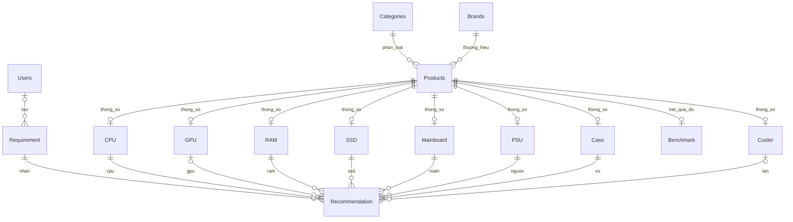

# Thiết kế database PC-DSS

## Phạm vi hiện tại

- `Requirement` lưu ngân sách VND và mục đích sử dụng. Ràng buộc SQL hiện chấp nhận `Office` và `Gaming`.
- Một cấu hình gồm một CPU, một mainboard, một bộ RAM, một SSD, một PSU và một case. GPU rời có thể vắng ở Office; Gaming cần GPU rời. Tản rời có thể vắng khi đúng SKU CPU có tản kèm hộp và tổ hợp đã được xác minh.
- Truy vấn kiểm tra hiện dùng mức RAM tối thiểu 16 GB và SSD tối thiểu 500 GB.
- Phạm vi kiểm tra gồm RAM desktop DDR4/DDR5, SSD NVMe M.2 2280 và tản khí. Kiểu dữ liệu lưu được thông số khác không đồng nghĩa truy vấn đã hỗ trợ loại đó.
- Tương thích chi tiết cần được đối chiếu tài liệu phần cứng. Kiểm tra tự động cơ bản không xác nhận mọi điều kiện lắp ráp.

## Cấu trúc

| Bảng | Nội dung |
|---|---|
| `Categories`, `Brands` | Danh mục và thương hiệu |
| `Products` | Thông tin chung, giá tham khảo, nguồn dữ liệu và trạng thái `IsActive` |
| `CPU`, `GPU`, `RAM`, `SSD`, `Mainboard`, `PSU`, `Case`, `Cooler` | Thông số riêng từng loại linh kiện |
| `Benchmark` | Một kết quả đo có nguồn cho mỗi CPU/GPU |
| `Requirement` | Ngân sách, nhu cầu, người dùng tùy chọn và thời gian |
| `Recommendation` | Các linh kiện được chọn, tổng giá, điểm, lý do và thứ hạng |
| `Users` | Thông tin tài khoản, mật khẩu đã hash và vai trò |

## Quan hệ

Mỗi sản phẩm đã duyệt phải có đúng một bảng thông số tương ứng danh mục. Khóa ngoại/`UNIQUE` không tự cấm một `ProductID` xuất hiện ở hai bảng thông số khác nhau. Import/API cần kiểm tra điều đó; `03-check-data.sql` hỗ trợ phát hiện dữ liệu sai sau nhập.

## Từ điển dữ liệu

Các ID là `INT` tự tăng. Dùng `ProductCode`, tên danh mục và tên hãng để tra ID khi nhập dữ liệu. Mọi quan hệ mặc định chặn xóa bản ghi đang được tham chiếu. Sản phẩm đã được đề xuất nên chuyển `IsActive = 0` thay vì xóa.

### Thông tin chung

| Bảng / trường | Ý nghĩa và quy ước |
|---|---|
| `Categories.CategoryName` | 8 tên seed: CPU, GPU, RAM, SSD, Mainboard, PSU, Case, Cooler. Tránh đổi tên các danh mục đang được dùng trong demo |
| `Brands.BrandName` | Tên hãng duy nhất; có thể bổ sung hãng khi thật sự cần |
| `Products.ProductCode` | Mã sản phẩm nội bộ, duy nhất, ví dụ `CPU-001`; không phải ID tự tăng |
| `ProductName` | Tên chính xác có model, dung lượng, số thanh, biến thể boxed/tray nếu áp dụng |
| `CategoryID`, `BrandID` | Liên kết danh mục và hãng của đúng sản phẩm, ví dụ card ASUS dùng chip AMD có hãng sản phẩm là ASUS |
| `Price` | Giá tham khảo VND nguyên, lớn hơn 0; chưa biết thì `NULL`, không điền 0 |
| `PriceSourceUrl`, `PriceCheckedAt` | Link đúng sản phẩm và ngày ghi nhận giá, dạng `YYYY-MM-DD`; có đủ cả ba trường giá hoặc để cả ba `NULL` |
| `SpecSourceUrl` | Link nguồn thông số cho đúng model; bắt buộc và không để chuỗi trống |
| `Description`, `Image` | Tùy chọn; link ảnh khi có, không cản việc hoàn thành dữ liệu cốt lõi |
| `IsActive` | Mặc định 0. Chuyển thành 1 sau khi đủ giá, đúng loại thông số, có benchmark nếu là CPU/GPU và đã kiểm tra dữ liệu |
| `Users` | `Name`, `Email` duy nhất, `PasswordHash`, `Role` (`User`/`Admin`), `CreatedAt`; chưa cần nhập để nhận tư vấn |

### Thông số riêng

Mọi bảng dưới đây có `ProductID` duy nhất. Trường không ghi “tùy chọn” là bắt buộc khi nhập hàng thông số đó.

| Bảng | Trường và ý nghĩa |
|---|---|
| `CPU` | `Socket`: mã thống nhất như AM4. `Core`, `Thread`: số nhân/luồng. `TdpW`: thông số nhiệt, tùy chọn. `HasIntegratedGPU`: có đồ họa tích hợp. `HasBoxCooler`: đúng sản phẩm và giá đang nhập có kèm tản CPU |
| `GPU` | `Chipset`: tên chip. `VramGb`: dung lượng VRAM. `RecommendedPsuW`: mức nguồn khuyến nghị từ hãng. `LengthMm`: chiều dài card, tùy chọn khi thu thập nhưng phải có trước khi kiểm tra lắp vào case |
| `RAM` | `KitCapacityGb`: tổng GB cả bộ. `ModuleCount`: số thanh. `SpeedMTs`: tốc độ MT/s. `RamType`: DDR4 hoặc DDR5. Bộ 2×16 GB ghi 32 và 2 |
| `SSD` | `CapacityGb`: dung lượng công bố, 1 TB ghi 1000. `Interface`: NVME hoặc SATA. `FormFactor`: demo dùng chính xác `M.2-2280` |
| `Mainboard` | `Socket`, `Chipset`, `RamType`; `MaxRamGb`, `RamSlots`; `SupportsNvme2280`: có khe tương ứng; `HasDisplayOutput`: có đầu ra hình dùng với iGPU; `FormFactor`: ATX, MATX hoặc MINI_ITX |
| `PSU` | `Watt`: công suất danh định. `FormFactor`: ATX, SFX hoặc SFX_L. `Efficiency`: chứng nhận hiệu suất nếu biết, tùy chọn |
| `Case` | `MotherboardSupport`: các mã kích thước main, tách bằng `|`. `PsuFormFactor`: loại PSU dùng trong tập demo. `GpuMaxLengthMm`, `CoolerMaxHeightMm`: giới hạn mm, tùy chọn lúc thu thập, cần có khi kiểm tra card/tản tương ứng |
| `Cooler` | Chỉ tản khí. `SocketSupport`: mã socket tách bằng `|`. `HeightMm`: chiều cao mm |

`MotherboardSupport` và `SocketSupport` là danh sách mã tách bằng `|`, không có dấu cách thừa hoặc phần tử trùng. So **đúng từng mã**, không tìm chuỗi con (`ATX` không được khớp nhầm `MATX`).

Giá trị boolean chỉ ghi 0/1 khi đã xác minh. Trường bắt buộc chưa biết được ghi chú trong mẫu thu thập; sản phẩm chưa đủ điều kiện để nhập hàng thông số hoặc duyệt.

### Benchmark và kết quả DSS

| Bảng | Trường và quy ước |
|---|---|
| `Benchmark` | `ProductID` chỉ thuộc CPU/GPU; `TestName`, `TestVersion`, `RawScore` > 0, `SourceUrl`, `CheckedAt`. Chọn bài đo có điểm càng cao càng tốt. `CheckedAt` là ngày thu thập |
| `Requirement` | `Budget` > 0 VND, `Purpose` là Office hoặc Gaming; `UserID` có thể `NULL`; `CreatedTime` tự ghi |
| `Recommendation` | Các khóa ngoại CPU/main/RAM/SSD/PSU/case bắt buộc, GPU và cooler có điều kiện; `TotalPrice` là tổng giá khi tạo, `Score` 0–100, `Reason` không rỗng, `Rank` 1–3 duy nhất trong một yêu cầu, `CreatedTime` tự ghi |

Điểm CPU và GPU có thể khác thang đo, cần chuẩn hóa riêng từng nhóm trước khi áp dụng trọng số. Các CPU dùng cùng bài đo/phiên bản; GPU có bài đo phù hợp riêng. Benchmark lưu kết quả đo từ nguồn được dẫn, không lưu điểm suy diễn từ thông số.

`Benchmark.ProductID` là duy nhất nên mỗi sản phẩm chỉ lưu một kết quả đo. `Recommendation.TotalPrice` lưu tổng giá lúc đề xuất; schema không giữ lịch sử giá từng món. Màn hình chi tiết cần phân biệt giá tham khảo hiện tại với tổng giá đã lưu.

## Kiểm tra trước khi đề xuất

Database bảo vệ khóa ngoại, giá/dung lượng dương, các trường bắt buộc và thứ hạng hợp lệ. Backend/DSS vẫn cần làm các việc sau trong cùng luồng tạo đề xuất:

1. Chỉ lấy sản phẩm đã duyệt, đúng bảng thông số; CPU/GPU đủ benchmark có thể so sánh.
2. Lọc socket, RAM, số khe, dung lượng, SSD NVMe M.2 2280; xác minh iGPU + đầu ra hình nếu không có GPU rời.
3. Kiểm tra main/case, GPU/case, tản/socket/case, loại PSU/case; không coi giá trị còn thiếu là “đạt”.
4. Kiểm tra mức nguồn khuyến nghị của GPU khi có GPU rời. Công suất toàn bộ cấu hình, đầu nối và các điều kiện chi tiết cần được xác minh riêng; so `Watt >= RecommendedPsuW` chưa đủ để xác nhận bộ nguồn phù hợp.
5. Đối chiếu danh sách CPU hỗ trợ/BIOS, cấu hình RAM và tản cho các tổ hợp sử dụng. Socket và TDP không thể hiện đầy đủ các điều kiện tương thích. Ghi nguồn xác minh trong bảng đối chiếu cấu hình ở mẫu dữ liệu.
6. Cộng giá của tất cả món, một bộ RAM tính một giá; không tính lại giá tản đi kèm CPU. Không vượt ngân sách. Tính điểm và chọn tối đa ba tổ hợp khác nhau; không đủ thì trả ít hơn, không tự nới ngân sách.
7. Khi lưu, tính lại tổng giá và kiểm tra dữ liệu đầu vào. Không nhận `Score`/`TotalPrice` do người dùng tự gửi làm kết quả đáng tin cậy. Các hàng liên quan được ghi trong transaction.

`03-check-data.sql` phát hiện một phần lỗi sau nhập, không phải thuật toán DSS. API lọc/xếp hạng chưa được triển khai. Các cấu hình đã đối chiếu tài liệu phục vụ xác minh dữ liệu và kiểm tra kết quả tư vấn.
